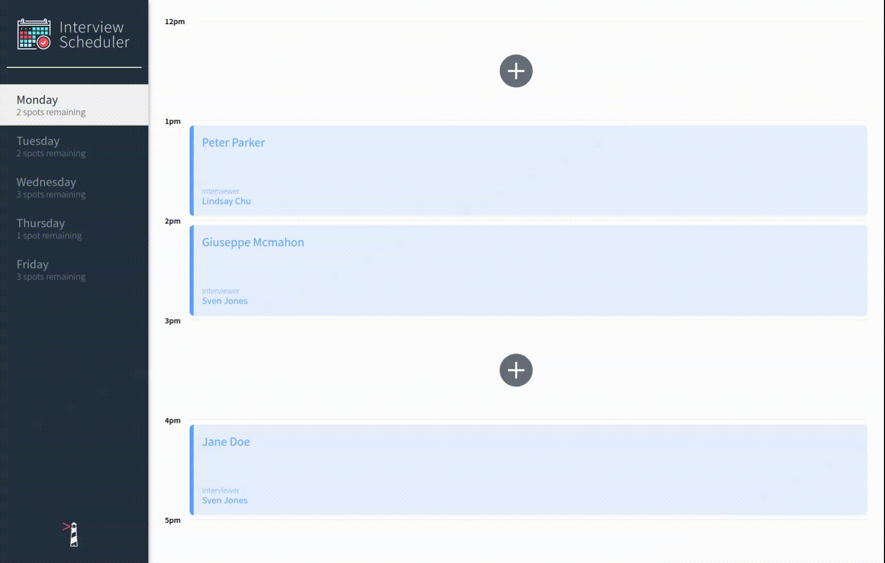

# Interview Scheduler

## Author
Yamac Ozdil

## About
This week at [Lighthouse Labs](https://www.lighthouselabs.ca/) we got our hands dirty with React.js, Jest, Cypress.io, Storybook, Heroku, CircleCi and Netlify.

Interview Scheduler lets a user (student) to book an interview with an interviewer by adding their name to scheduling component and easily selecting the interviewer.

The user can edit or delete an existing interview as well as track the available spots remaining on the left-hand sidebar.

<kbd></kbd>

## See for your self

1. Let's start with a GET request to https://s-int.herokuapp.com/api/days
2. Time for a cup of tea as we wait for Heroku to warm up..
3. Visit https://int-s.netlify.app/ and enjoy!

## Local Setup

1. Install dependencies with `npm install`.
2. Please also fork and clone the [scheduler-api](https://github.com/yozdil/scheduler-api) next to the project (in a seperate folder). Follow the instructions on README file for scheduler-api setup.
3. Have two terminals open and do the following:
```sh
TERMINAL 1: Running Webpack Development Server
cd scheduler
npm start
```
```sh
TERMINAL 2: Runnning the DB
cd scheduler-api
npm start
```

## Running Jest Test Framework

```sh
npm test
```

## Running Storybook Visual Testbed

```sh
npm run storybook
```
## Dependencies
- Axios
- Classnames
- Normalize.css
- React
- React Dom
- React Scripts
- Babel
- Babel Loader
- Storybook
- Jest
- Node Sass
- Prop-types
- React Test Renderer